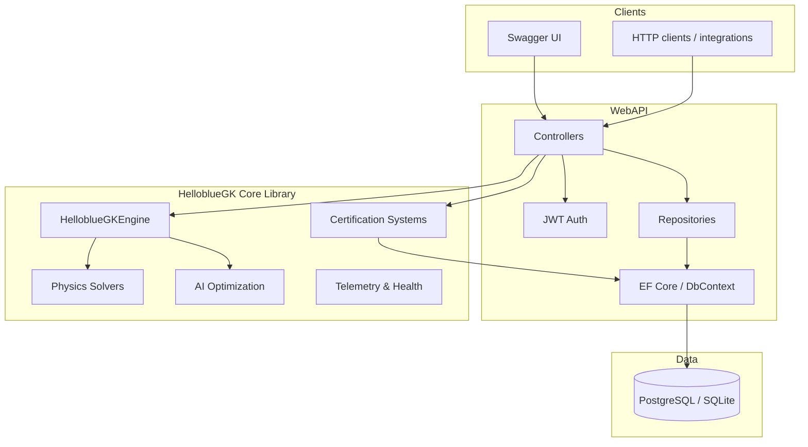

# Architecture

High-level map of the HelloblueGK **Community Edition** codebase for contributors. Product tiers and legal scope: [OPEN_SOURCE_SCOPE.md](OPEN_SOURCE_SCOPE.md).

## Overview

HelloblueGK is a **.NET 9** aerospace engine simulation platform. The **Web API** is the primary deployable application; it references the **core library** and exposes REST endpoints for simulation, certification, AI optimization, and operations.

## Projects

| Project | Path | Role |
|---------|------|------|
| **HelloblueGK** | `HelloblueGK.csproj` | Shared library: physics, AI, certification logic, engine kernel |
| **HelloblueGK.WebAPI** | `WebAPI/` | ASP.NET Core host, controllers, persistence, auth |
| **HelloblueGK.Tests** | `Tests/` | xUnit tests (unit, integration, security) |
| **PlasticityDemo** | `PlasticityDemo/` | Standalone console demo (optional Plasticity integration) |

Open **`HelloblueGK.sln`** in your IDE to work across all projects.

## Directory guide

### `WebAPI/`

Entry point for most contributors.

- `Program.cs` — app startup, middleware, DI registration
- `Controllers/` — REST endpoints (`Engines`, `Simulations`, `Auth`, `Certification/*`, …)
- `Data/` — `HelloblueGKDbContext`, EF models, repositories
- `Authorization/` — policies and access rules
- `Configuration/` — options binding

### `Core/`

Engine platform services used by the API and simulations.

- `HelloblueGKEngine.cs` — central engine orchestration
- `Control/` — throttle, startup sequences
- `Telemetry/` — metrics and monitoring
- `Hardware/` — sensor/actuator abstractions
- Health, rate limiting, logging, validation services

### `Physics/`

Multi-physics solvers and interfaces.

- `IPhysicsSolver.cs` — solver contract
- `AdvancedCFDSolver.cs`, `AdvancedThermalSolver.cs`, `AdvancedStructuralSolver.cs`
- `RealPhysicsSolvers/` — external solver integrations (e.g. OpenFOAM)

### `AI/`

Design optimization and hybrid computing.

- `AIOptimizationEngine.cs`, `ReinforcementLearningEngine.cs`
- `QuantumClassicalHybridEngine.cs`

### `Certification/`

Flight-software style compliance subsystems (requirements traceability, problem reports, configuration management, test coverage, code reviews). Exposed via `WebAPI/Controllers/Certification/`.

### `Tests/`

- `Unit/Core/` — core library tests
- `Unit/WebAPI/` — API and security tests
- `Integration/` — broader integration and performance tests

## Request flow (typical API call)

1. Client sends HTTP request with optional `Authorization: Bearer <JWT>`
2. ASP.NET middleware: rate limiting, auth, exception handling
3. Controller action validates input and calls repository or core service
4. Core/physics/AI logic runs simulation or business rules
5. Results persisted via EF Core when needed
6. JSON response returned (or standardized error via `ErrorResponse`)

## Data layer

- **Development:** SQLite (auto-created) or local PostgreSQL
- **Production:** PostgreSQL (e.g. Render) via `ConnectionStrings__DefaultConnection`
- Migrations and seed scripts live under `WebAPI/Data/` and `WebAPI/Scripts/`

## Deployment

- **Docker:** `Docker/Dockerfile` (Web API image)
- **Render:** `render.yaml`, `Docker/Dockerfile.render`
- **CI:** `.github/workflows/ci.yml` — build, test, coverage on every PR

## Related docs

- [DEVELOPERS.md](DEVELOPERS.md) — setup and commands
- [API_DOCUMENTATION.md](API_DOCUMENTATION.md) — endpoint reference
- [Certification/README.md](Certification/README.md) — certification APIs
- [Docs/Technical/TECHNICAL_LIMITATIONS_AND_ROADMAP.md](Docs/Technical/TECHNICAL_LIMITATIONS_AND_ROADMAP.md) — honest capability boundaries
