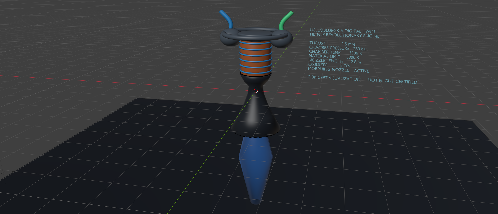

# HelloblueGK — Aerospace Engine Simulation Platform

[](https://github.com/HelloblueAI/HelloblueGK/actions/workflows/ci.yml)
[](LICENSE)
[](https://dotnet.microsoft.com/)
[](Certification/Artifacts/coverage-floors.json)
[](Certification/Artifacts/coverage-floors.json)
[](https://github.com/HelloblueAI/HelloblueGK/actions/workflows/ci.yml)
[](Docs/VERIFICATION_SCOPE.md)

<div align="center">



**HB-NLP Revolutionary Engine — digital twin visualization**

*Concept visualization, not flight certified.* Two notes on what the overlay shows, because the
numbers in it should not be read as a specification.

The render labels 3500 K as a chamber temperature. That label is wrong: the engine design declares
no chamber temperature at all. 3800 K and 3500 K are material limits — the chamber alloy and the
nozzle composite respectively. The declared thrust and specific impulse are also internally
inconsistent with the declared geometry, by a factor of six in thrust; the discrepancies are
measured and gated in [verification scope](Docs/VERIFICATION_SCOPE.md).

For a number this repository does stand behind, the
[nozzle solver](Physics/IdealRocketNozzle.cs) reproduces the published specific impulse of
Merlin 1D, Raptor, and RS-25 to within 1%, always erring high as ideal theory must.

</div>

A .NET 9 platform for rocket engine performance analysis, with a nozzle solver validated against
published flight-engine data and a DO-178C Level A verification gate enforced on every build.

> **Community Edition** (Apache 2.0) — reference platform for integration, research, and contribution.
> **Not certified flight software.** [OPEN_SOURCE_SCOPE.md](OPEN_SOURCE_SCOPE.md) is authoritative for
> tiers, warranties, and compliance boundaries.

---

## Start here

```bash
git clone https://github.com/HelloblueAI/HelloblueGK.git
cd HelloblueGK
dotnet restore HelloblueGK.sln
dotnet build HelloblueGK.sln
dotnet test Tests/HelloblueGK.Tests.csproj

cd WebAPI && dotnet run
# Open http://localhost:5000/swagger
```

| I want to… | Go to |
|------------|-------|
| **Know what is verified vs simulated** | [Docs/VERIFICATION_SCOPE.md](Docs/VERIFICATION_SCOPE.md) |
| **Understand what's public vs commercial** | [OPEN_SOURCE_SCOPE.md](OPEN_SOURCE_SCOPE.md) |
| **Set up locally** | [DEVELOPERS.md](DEVELOPERS.md) |
| **Understand the codebase** | [ARCHITECTURE.md](ARCHITECTURE.md) |
| **Read the API reference** | [API_DOCUMENTATION.md](API_DOCUMENTATION.md) |
| **Make a first PR** | [CONTRIBUTING.md](CONTRIBUTING.md) — docs and tests are the safe start |
| **Pick a starter task** | [good first issues](https://github.com/HelloblueAI/HelloblueGK/issues?q=is%3Aissue+is%3Aopen+label%3A%22good+first+issue%22) |
| **Report a bug** | [Issue template](https://github.com/HelloblueAI/HelloblueGK/issues/new?template=bug_report.yml) |
| **Run the interactive demo** | [Docs/Project/DEMO.md](Docs/Project/DEMO.md) |
| **Deploy your own instance** | [Docs/Deployment/DEPLOY_TO_RENDER.md](Docs/Deployment/DEPLOY_TO_RENDER.md) |
| **Reproduce CI locally** | [Docs/Technical/TESTING_LOCALLY.md](Docs/Technical/TESTING_LOCALLY.md) |

---

## What is actually verified

This project draws a hard line between code whose behaviour is verified and code that produces
well-formed output for demonstration. The line is documented in
[VERIFICATION_SCOPE.md](Docs/VERIFICATION_SCOPE.md) and enforced in CI, because the difference is
not visible from a method signature.

### Nozzle performance, validated against flight engines

`IdealRocketNozzle` implements quasi-one-dimensional ideal rocket theory — characteristic
velocity, choked mass flow, the area–Mach relation and its numerical inverse, isentropic exit
conditions, and thrust as the momentum term plus the pressure term. Given published chamber
conditions and area ratios, it reproduces published specific impulse:

| Engine | Computed Isp | Published | Agreement |
|--------|-------------:|----------:|----------:|
| Merlin 1D, sea level | 284.2 s | 282 s | +0.8% |
| Raptor, sea level | 332.7 s | 330 s | +0.8% |
| RS-25, vacuum | 453.0 s | 452.3 s | +0.1% |

The tests additionally assert that ideal theory never *under*predicts a real engine: every loss the
ideal model neglects reduces real performance, so underprediction would indicate an error in the
algebra rather than a conservative result. `IdealRocketNozzle.cs`, `EngineOperatingPoint.cs`, and
`NozzleFlowSolver.cs` are at 100% line and 100% branch coverage.

Sources: Sutton & Biblarz, *Rocket Propulsion Elements*, 9th ed., ch. 3 and 5; NASA SP-8120.

**Not claimed:** this is a one-dimensional equilibrium model, not a flow solver. It says nothing
about combustion stability, boundary layers, flow separation, nozzle heat transfer, or off-design
transients.

### A DO-178C Level A gate that can fail the build

[`Tools/CertificationGate`](Tools/CertificationGate) runs on every build against a declared
boundary in [`certification-boundary.json`](Certification/Artifacts/certification-boundary.json).
It verifies statement and decision coverage, MC-DC with recorded independence pairs, and
requirements traceability from requirement through design and code to a passing test — then fails
the build if any objective regresses.

The boundary is deliberately narrow: a small set of files the project genuinely meets, rather than
a claim over the whole repository. What a passing gate does and does not establish is recorded in
the artifact itself.

### Coverage floors enforced per directory

[`coverage-floors.json`](Certification/Artifacts/coverage-floors.json) sets minimum line and branch
coverage per directory, checked in CI from the measured report. Current: **52.9% line, 52.3%
branch** overall across 23,420 lines, with **1,214 tests** passing and zero build warnings.

### What is simulation scaffolding

The legacy `AdvancedCFDSolver` and `AdvancedStructuralSolver` accept a model parameter and do not
read it, so their output is the same for every engine analysed. Several generative and orchestration
methods return constants after `Task.Delay`. None of it is verified engineering, and no result it
produces should be cited as an analysis of a physical system. Each case is named in
[VERIFICATION_SCOPE.md](Docs/VERIFICATION_SCOPE.md).

---

## Engine reference models

Published parameters for engines used as validation references and design comparisons.

| Engine | Thrust | Isp | Chamber pressure | Propellant | Status |
|--------|-------:|----:|-----------------:|------------|--------|
| **Raptor** | 2,200 kN | 330 s | 300 bar | Methane/LOX | Flight proven |
| **Merlin 1D** | 845 kN | 282 s | 98 bar | RP-1/LOX | Flight proven |
| **RS-25** | 1,860 kN | 452 s | 207 bar | Hydrogen/LOX | Flight proven |
| **HB-NLP-REV-001** | 3,500 kN | 420 s | 280 bar | — | Concept design |

The first three are the references the nozzle solver is validated against. HB-NLP-REV-001 is a
concept design generated by this repository, not a built or tested engine.

---

## Platform capabilities

| Area | What exists | Verification status |
|------|-------------|---------------------|
| **Nozzle performance** | Ideal rocket theory solver, input-driven | Validated against three flight engines |
| **Certification workflows** | Requirements traceability, problem reporting, configuration management, test coverage, formal code review — with REST APIs and persistence | 91.5% line coverage; gates fail closed on placeholder or unverified evidence |
| **Reinforcement learning** | Q-learning controller for engine parameter tuning | Bellman backup, reward shaping, and action dynamics pinned by tests |
| **Aerospace readiness** | Mission-level classification and compliance scoring | Decision logic tested; scores derive from fixed inputs, not measurements |
| **Web API** | ASP.NET Core 9, JWT auth, API versioning, rate limiting, Swagger, PostgreSQL | 61.4% line coverage |
| **Multi-physics solvers** | CFD, structural, thermal interfaces and couplers | Control flow verified; **results are not input-dependent** |
| **Digital twin / generative design** | Interfaces and orchestration | Simulation scaffolding |

---

## Certification workflow APIs

Reference tooling that **supports** aerospace software lifecycle practices. This is not certified
flight software and does not replace a qualification program.

```
/api/v1/certification/requirements     requirements → design → code → test traceability
/api/v1/certification/problem-reports  formal problem report tracking
/api/v1/certification/configuration    baseline and change management
/api/v1/certification/test-coverage    coverage and MC-DC tracking
/api/v1/certification/code-reviews     formal review workflow
```

These systems fail closed. A baseline cannot be approved by the person who created it, evidence
naming a placeholder such as `n/a` or `TBD` does not satisfy a gate, and a requirement cannot be
marked verified against a test that has not passed.

Details: [Certification/README.md](Certification/README.md) ·
[API Quick Start](Certification/API_QUICK_START.md) ·
[Progress](Certification/CERTIFICATION_PROGRESS.md)

**Design targets**, achieved only through your organization's own qualification program:
DO-178C-oriented and NASA NPR 7150.2-oriented workflows. Export-controlled programs require
separate legal review.

---

## Architecture

```
WebAPI (ASP.NET Core 9)      auth, versioning, rate limiting, Swagger
      │
      ├── Certification/     RTM, problem reports, config management, coverage, reviews
      ├── Physics/           nozzle solver (validated), CFD/structural/thermal (scaffolding)
      ├── Aerospace/         engine models, compliance and readiness assessment
      ├── AI/                reinforcement learning, generative design scaffolding
      ├── Core/              telemetry, health, configuration, performance services
      └── Models/            shared domain types

Tools/CertificationGate      DO-178C Level A gate, runs in CI
```

Full description, including the optional geometry-integration boundary:
[ARCHITECTURE.md](ARCHITECTURE.md).

---

## Hosted reference

**Base URL:** [hellobluegk.onrender.com](https://hellobluegk.onrender.com)

| Endpoint | Auth | Purpose |
|----------|------|---------|
| `/Health` | none | liveness |
| `/Health/detailed` | bearer token | component detail |
| `/Health/engine` | bearer token | engine subsystem status |
| `/metrics` | bearer token | Prometheus exposition |
| `/swagger` | Microsoft Entra ID SSO | interactive API browser |

Swagger is treated as internal documentation: in production it redirects to corporate single sign-on
rather than being publicly readable, as described in
[INTERNAL_SWAGGER_SSO.md](Docs/Deployment/INTERNAL_SWAGGER_SSO.md). `/Health` is the only
unauthenticated endpoint.

This is a reference deployment, not an open sandbox — registration is disabled. Clone and run your
own instance if you need one you control.

```bash
curl https://hellobluegk.onrender.com/Health

# Authenticated calls use a bearer token from /api/v1/Auth/login
curl https://hellobluegk.onrender.com/api/v1/engines \
  -H "Authorization: Bearer YOUR_TOKEN"
```

Full endpoint reference: [API_DOCUMENTATION.md](API_DOCUMENTATION.md).

---

## Testing

```bash
dotnet test Tests/HelloblueGK.Tests.csproj                        # all 1,214 tests
dotnet test --filter Category=Integration                         # integration suite
dotnet test --filter Category=Performance                         # performance benchmarks
dotnet test --filter 'FullyQualifiedName~IdealRocketNozzleTests'  # nozzle validation
```

`Integration` and `Performance` are the only category traits defined, so other `Category=` filters
match nothing and pass while running zero tests.

Coverage and the certification gate run in the **Build and Test** job, which is a required check on
`main` — the gate and the floors can fail a merge. To reproduce the full pipeline locally, see
[TESTING_LOCALLY.md](Docs/Technical/TESTING_LOCALLY.md).

---

## Deployment

```bash
docker build -t hellobluegk:latest -f Docker/Dockerfile .
docker run -p 8080:8080 -e Jwt__Key="a-secret-of-at-least-32-characters" hellobluegk:latest
# http://localhost:8080/swagger
```

Set `DATABASE_URL` and `Jwt__Key` from the environment; never commit secrets. Render is the supported
path and is described in [DEPLOY_TO_RENDER.md](Docs/Deployment/DEPLOY_TO_RENDER.md), with database
setup in [RENDER_POSTGRESQL_SETUP.md](Docs/Deployment/RENDER_POSTGRESQL_SETUP.md). The deployed
service builds `Docker/Dockerfile.render`; the plain `Docker/Dockerfile` above is the local
equivalent. A Kubernetes manifest (`k8s-deployment.yaml`) is provided as a starting point rather than
a CI-validated path.

---

## Security

Bearer-token authentication with issuer and audience validation, request rate limiting and body-size
guards, input validation, security headers, and CORS restricted by configuration.

CodeQL analyses C#, Python, and the workflows themselves, and GitGuardian scans every pull request
for committed secrets. A required **Security Scan** job fails the build on a known-vulnerable NuGet
package, and a scheduled daily audit repeats that check and reports deprecated packages.

`main` requires passing **Build and Test**, **Integration Tests**, **Code Quality Checks**, and
**Security Scan**, plus code-owner review, linear history, and resolved conversations.

Report vulnerabilities per [SECURITY.md](SECURITY.md) — please do not open a public issue.
Industry-standard patterns are used throughout; the Community Edition makes no FIPS or formal
accreditation claim.

---

## Project identity

**HelloblueGK** is an independent open-source project maintained by [Helloblue](https://helloblue.ai).
It is **not** a fork of, affiliated with, or endorsed by [LEAP 71's PicoGK](https://github.com/leap71/PicoGK)
geometry kernel, and it does not vendor PicoGK source.

| Question | Answer |
|----------|--------|
| Is this PicoGK? | No — different product and maintainer. |
| Is this a fork of `leap71/PicoGK`? | No — separate repository and codebase. |
| Clone folder name | Use `HelloblueGK`. See [DEVELOPERS.md](DEVELOPERS.md). |
| Future geometry integration | Optional; may reference PicoGK as an external library later. See [ARCHITECTURE.md](ARCHITECTURE.md#optional-geometry-integration-picogk). |

### Product tiers

| Tier | Available | Notes |
|------|-----------|-------|
| **Community Edition** | This repository | Apache 2.0 — APIs, reference code, tests, docs |
| **Hosted Platform** | [hellobluegk.onrender.com](https://hellobluegk.onrender.com) | Reference deployment; auth required, no open signup |
| **Enterprise / Certification** | Commercial | Formal compliance packages, SLAs, production support — **not in this repository** |

Production certification evidence and export-controlled data are not published here.

---

## Contributing

New contributors are welcome, and a first PR does not need to touch certification or security
gates. [CONTRIBUTING.md](CONTRIBUTING.md) describes the first-hour path and how review works.

- [Good first issues](https://github.com/HelloblueAI/HelloblueGK/issues?q=is%3Aissue+is%3Aopen+label%3A%22good+first+issue%22)
- [Discussions](https://github.com/HelloblueAI/HelloblueGK/discussions) — questions before you write code
- [Issues](https://github.com/HelloblueAI/HelloblueGK/issues) — bugs and features
- [Code of Conduct](CODE_OF_CONDUCT.md)

---

## Further documentation

| Document | Contents |
|----------|----------|
| [Docs/VERIFICATION_SCOPE.md](Docs/VERIFICATION_SCOPE.md) | Verified engineering versus simulation scaffolding |
| [Docs/Technical/TECHNICAL_LIMITATIONS_AND_ROADMAP.md](Docs/Technical/TECHNICAL_LIMITATIONS_AND_ROADMAP.md) | Known limitations and development roadmap |
| [Docs/Technical/VALIDATION_AND_BENCHMARKS.md](Docs/Technical/VALIDATION_AND_BENCHMARKS.md) | Validation results and benchmark data |
| [Docs/Design/AdvancedCFDSolver.md](Docs/Design/AdvancedCFDSolver.md) | Design description for a unit inside the certification boundary |
| [Docs/README.md](Docs/README.md) | Index of all documentation |
| [.github/CONFIGURATION.md](.github/CONFIGURATION.md) | CI workflows, templates, and what CI enforces on a PR |

---

## License

Apache License 2.0 — see [LICENSE](LICENSE). You may use, modify, and distribute this software,
including commercially, provided you retain the copyright and license notices and state significant
changes. It is provided "as is", without warranties or conditions of any kind.

Nothing in this repository constitutes a certification, airworthiness approval, or regulatory
finding. Users are responsible for their own qualification programs and for compliance with
ITAR, EAR, and other applicable regulations.

---

## Acknowledgments

- **SpaceX** for published Raptor and Merlin engine specifications
- **NASA** for published RS-25 performance data and the NPR 7150.2 software engineering requirements
- **RTCA** for DO-178C, the basis of the verification objectives enforced here
- **Sutton & Biblarz** for *Rocket Propulsion Elements*, the source of the nozzle relations
- **The .NET and open-source communities** for the tooling this platform is built on

<div align="center">

**[Helloblue, Inc.](https://helloblue.ai) · HB-NLP Research Lab**

</div>
